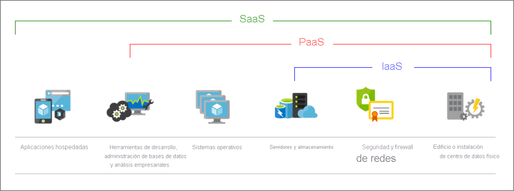
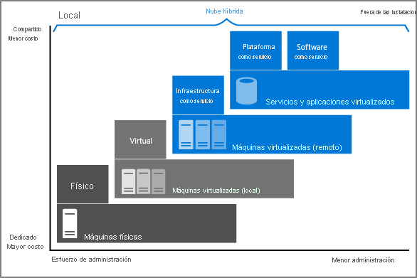
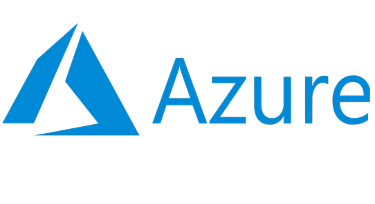
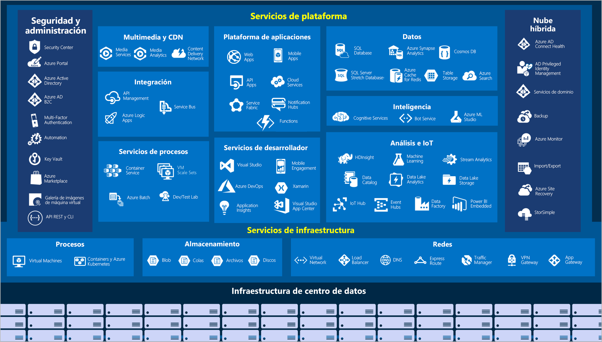

# LA NUBE DE AZURE

## ¿Qué es la nube?

_**La nube**_ es la entrega de servicios informáticos a través de Internet mediante un modelo de precios de pago por uso. Estos servicios incluyen servidores, almacenamiento, bases de datos, redes, software, análisis e inteligencia artificial.

La informática en la nube ofrece una _innovación más rápida_, _recursos flexibles_ y _economías de escala_. Además de:

* Elimina el gasto por capital.
* Reducir los costos operativos.
* Ejecutar la infraestructura de forma más eficaz.
* Escalar a medida que cambien las necesidades empresariales.
* Proporcionar nuevas características a los usuarios a velocidades récord
* Ofrecer una experiencia cada vez más amplia y envolvente con sus dispositivos y con el software

Para desarrollar los servicios y ofrecer experiencias de usuario innovadoras y novedosas más rápidamente, la nube proporciona acceso a petición para:

* Un grupo casi ilimitado de componentes de proceso, almacenamiento y redes sin procesar.
* Reconocimiento de voz y otros servicios cognitivos que ayudan a hacer que su aplicación destaque entre la multitud.
* Servicios de análisis que proporcionan datos de telemetría desde el software y los dispositivos.

## Ventajas de la nube

* **Confiabilidad**: Proporcionar una experiencia de usuario _continua_ sin tiempo de inactividad perceptible aunque se produzcan errores.
* **Escalabilidad**: _Capacidad de crecer_. Se pueden escalar de dos maneras, sacando partido al mismo tiempo del _escalado automático_:
  * _**Vertical**_: La _capacidad informática_ se puede aumentar si se agrega _RAM_ o _CPU_ adicionales a una máquina virtual.
  * _**Horizontal**_: La capacidad informática se puede aumentar si se agregan _instancias de un recurso_, como máquinas virtuales adicionales a la configuración.
* **Elasticidad**: Se pueden configurar para que _siempre_ tengan los recursos que necesitan.
* **Agilidad**: Los recursos basados en la nube se pueden implementar y configurar _rápidamente_ a medida que cambian los requisitos de la aplicación.
* **Distribución geográfica**: Las aplicaciones y los datos se pueden implementar en centros de datos regionales de _todo el mundo_, lo que garantiza que los clientes siempre tendrán el _mejor rendimiento_ de su región.
* **Recuperación ante desastres**: Al usar los servicios de _copia de seguridad_ basados en la nube, la replicación de datos y la distribución geográfica, podrá implementar las aplicaciones con la seguridad de saber que los datos están _protegidos_ en caso de que se produzca un desastre.

## Modelos de servicio en la nube

### Iaas

El proveedor de servicios en la nube _mantendrá actualizado el hardware_, pero el _mantenimiento del sistema operativo y la configuración de red_ serán su responsabilidad como inquilino de nube.

* **Ventajas**: Sin gastos de capital, ágil, modelo basado en consumo, flexible, no se requieren conocimientos de la infraestructura.

### PaaS

El proveedor de servicios en la nube _administra las máquinas virtuales y los recursos de red_, y el inquilino de nube _implementa sus aplicaciones en el entorno de hospedaje administrado_.

* **Ventajas**: Sin gastos de capital, ágil, modelo basado en consumo, flexible, no se requieren conocimientos de la infraestructura, aumento de productividad.
* **Desventajas**: Limitaciones de la plataforma.

### SaaS

El proveedor de servicios en la nube _administra todos los aspectos del entorno de la aplicación_, como las máquinas virtuales, los recursos de red, el almacenamiento de datos y las aplicaciones. El inquilino de nube _solo necesita proporcionar sus datos_ a la aplicación administrada por el proveedor de servicios en la nube.

* **Ventajas**: Sin gastos de capital, ágil, modelo de precio de pago por uso, flexible.
* **Desventajas**: Limitaciones de software.

_Servicios que pueden ejecutarse en cada uno de los modelos de servicio en la nube._

## Informática sin servidor

La informática sin servidor permite que los desarrolladores creen aplicaciones más rápidamente, ya que _elimina la necesidad de administrar la infraestructura_. En las aplicaciones sin servidor, el proveedor de servicios en la nube aprovisiona, escala y administra automáticamente la infraestructura necesaria para ejecutar el código.

## Nube pública, privada e híbrida

### Nube pública

Los servicios son ofrecidos mediante internet pública y están disponibles para cualquiera que quiera comprarlos. Los recursos de nube son propiedad de un proveedor de servicios en la nube de terceros, que los explota y distribuye mediante internet.

### Nube privada

Los recursos informáticos son de uso exclusivo de los usuarios de una empresa u organización. Esta se ubica físicamente y es administrada por la empresa.

### Nube híbrida

Combina la nube pública con la privada, lo que permite compartir datos y aplaciones entre estas dos.

_Implementación de la nube híbrida_

## ¿Qué es Azure?

> Azure es un _conjunto de servicios en la nube_ en expansión constante que ayudan a la organización a cumplir los desafíos empresariales actuales y futuros

Azure ofrece la libertad de _compilar_, _administrar_ e _implementar_ aplicaciones en una red global masiva mediante sus herramientas y plataformas favoritas.

## Ventajas que proporciona Azure

* Crear a su ritmo.
* Operar en el entorno híbrido sin problemas.
* Confianza en la nube.
* Proporciona más de cien servicios que permiten hacer todo tipo de cosas.
* Distintas maneras de acceder a Azure.
* Asigna y controla los recursos de forma inteligente dentro de cada región para garantizar que las cargas de trabajo están bien compensadas.

## Servicios de Azure

* **Proceso**: Azure proporciona una amplia gama de opciones para hospedar aplicaciones y servicios.
* **Redes**: La funcionalidad de red de Azure incluye una gama de opciones para conectar el mundo exterior a servicios y características de los centros de datos globales de Azure.
* **Almacenamiento**: Azure proporciona cuatro tipos principales de servicios de almacenamiento.
* **Móvil**: Los desarrolladores pueden crear servicios de back-end móviles para aplicaciones iOS, Android y Windows de forma rápida y sencilla.
* **Bases de datos**: Azure proporciona varios servicios de base de datos para almacenar una gran variedad de volúmenes y tipos de datos.
* **Web**: Azure incluye soporte técnico de primera clase para compilar y hospedar aplicaciones web y servicios web basados en HTTP.
* **Internet de las cosas (IoT)**: Muchos servicios pueden ayudar e impulsar soluciones de un extremo a otro para IoT en Azure.
* **Macrodatos**: Azure admite una amplia gama de tecnologías y servicios para proporcionar soluciones de análisis y macrodatos.
* **Inteligencia Artificial**: Azure provee servicios de inteligencia artificial y aprendizaje automático.
* **DevOps**: Reúne a individuos, procesos y tecnología mediante la automatización de la entrega de software para ofrecer un valor continuo a los usuarios.

_Vista general de los servicios y características disponibles de Azure._

## Administración de las suscripciones, los grupos de administración y los recursos de Azure

En Azure existen diferentes niveles que permiten mantener una mejor organización en cuanto al control de suscripciones, recursos adquiridos, costos y accesos por parte de los usuarios, acontinuación menciono los diferentes niveles que maneja Azure para mantener un mejor control de estos concepto;

**Recursos**: Los recursos son instancias de servicios que puede crear, como máquinas virtuales, almacenamiento o bases de datos SQL.
**Grupos de recursos**: Los recursos se combinan en grupos de recursos, que actúan como contenedor lógico en el que se implementan y administran recursos de Azure como aplicaciones web, bases de datos y cuentas de almacenamiento.
**Suscripciones**: Una suscripción agrupa las cuentas de usuario y los recursos que han creado esas cuentas de usuario. Para cada suscripción, hay límites o cuotas en la cantidad de recursos que se pueden crear y usar. Las organizaciones pueden usar las suscripciones para administrar los costos y los recursos creados por los usuarios, equipos o proyectos.
**Grupos de administración**: Estos grupos le ayudan a administrar el acceso, las directivas y el cumplimiento de varias suscripciones. Todas las suscripciones de un grupo de administración heredan automáticamente las condiciones que se aplican al grupo de administración.

## Suscripciones de Azure

El uso de Azure requiere una suscripción de Azure. Una suscripción le proporciona acceso autenticado y autorizado a los servicios y productos de Azure. Además, también le permite aprovisionar los recursos. Una suscripción de Azure es una unidad lógica de servicios de Azure que está vinculada a una cuenta de Azure, que es una identidad en Azure Active Directory (Azure AD) o en un directorio en el que confía Azure AD.

## Grupos de administración de Azure

Si la organización tiene muchas suscripciones, es posible que necesite una forma de administrar con eficacia el acceso, las directivas y el cumplimiento para esas suscripciones. Los grupos de administración de Azure ofrecen un nivel de ámbito que está por encima de las suscripciones. Las suscripciones se organizan en contenedores llamados grupos de administración y las condiciones de gobernanza se aplican a los grupos de administración. Todas las suscripciones dentro de un grupo de administración heredan automáticamente las condiciones que se aplican al grupo de administración. Los grupos de administración proporcionan capacidad de administración de nivel empresarial a gran escala con independencia del tipo de suscripciones que tenga. Todas las suscripciones de un único grupo de administración deben confiar en el mismo inquilino de Azure AD.

Por ejemplo, puede aplicar directivas a un grupo de administración que limite las regiones disponibles para la creación de máquinas virtuales. Esta directiva se aplicaría a todos los grupos de administración, las suscripciones y los recursos de ese grupo de administración, al permitir únicamente que se creen máquinas virtuales en esa región.

## Base de datos SQL de Azure

_Azure SQL Database_ es una base de datos relacional basada en la última versión estable del motor de base de datos de Microsoft SQL Server. SQL Database es una base de datos segura, completamente administrada y de alto rendimiento. Puede usarlo para crear aplicaciones y sitios web basados en datos en el lenguaje de programación que elija, sin necesidad de administrar la infraestructura.

## Características de base de datos SQL de Azure

Azure SQL Database es un motor de base de datos de plataforma como servicio (PaaS). Maneja la mayoría de las funciones de administración de la base de datos, como actualización, parcheo, copias de seguridad y monitoreo, sin la participación del usuario. SQL Database proporciona una disponibilidad del 99,99 por ciento. Las capacidades de PaaS que están integradas en SQL Database le permiten concentrarse en las actividades de optimización y administración de bases de datos específicas del dominio que son críticas para su negocio. SQL Database es un servicio totalmente administrado que tiene incorporada alta disponibilidad, copias de seguridad y otras operaciones de mantenimiento comunes. Microsoft maneja todas las actualizaciones del código SQL y del sistema operativo. No tiene que administrar la infraestructura subyacente.

Puede crear una capa de almacenamiento de datos de alta disponibilidad y alto rendimiento para las aplicaciones y soluciones en Azure. SQL Database puede ser la opción correcta para una variedad de aplicaciones modernas en la nube porque le permite procesar tanto datos relacionales como estructuras no relacionales, como gráficos, JSON, espaciales y XML.

Puede utilizar funciones avanzadas de procesamiento de consultas, como tecnologías en memoria de alto rendimiento y procesamiento inteligente de consultas. De hecho, las capacidades más nuevas de SQL Server se lanzan primero a SQL Database y luego al propio SQL Server. Obtiene las capacidades más recientes de SQL Server, sin gastos generales de actualizaciones, probadas en millones de bases de datos.
